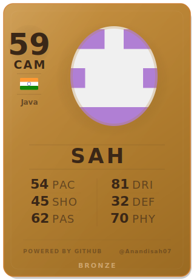

<!-- 🎮 Auto-generated FIFA-style GitHub profile — do not edit manually -->
<!-- Last updated: 2026-07-22T08:13:42.065Z -->

 

 

&nbsp;

&nbsp;

---

## ⚽ Scouting Report

> **BRONZE** · the magician: a polyglot working across many stacks.

| Attribute | Rating |
|:---|:---|
| **Skill Moves** | ★★★★☆ |
| **Weak Foot** | ★★☆☆☆ |
| **Work Rate** | Low / Low |
| **Play Style** | Creative |
| **Archetype** | Fantasista |
| **Top Language** | Java |

---

## 🛠️ Tech Stack

---

## 📊 Season Stats

&nbsp;

---

## 🏆 Trophy Cabinet

---

## 📈 Contribution Graph

---

&nbsp;

  

 

⚡ Auto-updated every 6 hours by <a href="https://github.com/Anandisah07/Anandisah07/actions">GitHub Actions</a> · Last: 2026-07-22T08:13:42.065Z

